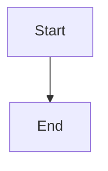

# Madushan Lamahewa - Blog

Personal blog built with Jekyll and the Minima theme, customized with a Dracula color palette.

## Local Development

### Prerequisites

- Ruby 3.2.2 (see `.ruby-version`)
- Bundler

### Setup

```bash
# Install dependencies
bundle install

# Serve locally with live reload
bundle exec jekyll serve

# Build for production
JEKYLL_ENV=production bundle exec jekyll build
```

### Project Structure

- `_posts/` - Blog articles in Markdown
- `_includes/` - HTML partials (head, header, footer)
- `_layouts/` - Page templates
- `assets/` - SCSS stylesheets and images

### Adding Mermaid Diagrams

To include Mermaid diagrams in a post, add `mermaid: true` to the front matter:

```yaml
---
layout: post
title: "My Post"
mermaid: true
---
```

Then use fenced code blocks:



## Deployment

This site is configured for static hosting. The built site is output to `_site/`.

## License

Content copyright Madushan Lamahewa.
