# AI Agent Design Patterns

*A Systems-Level Guide to Architecting Intelligent, Tool-Using Agents*

---

## 1. Introduction

An **AI agent** is not merely a prompt wrapped around a large language model. It is a **closed-loop system** that continuously:

1. **Perceives** inputs (text, APIs, structured data, events)
2. **Reasons** about goals, constraints, and context
3. **Acts** via tools or direct responses
4. **Evaluates and adapts** using feedback signals

Modern production agents integrate:

* Large Language Models (LLMs)
* Tooling layers (APIs, databases, search, code execution)
* Memory systems (short-term, long-term, episodic)
* Planning modules
* Verification and reflection loops
* Multi-agent coordination mechanisms

Designing such systems requires explicit architectural decisions. This article consolidates the core **design patterns, coordination models, memory strategies, safety mechanisms, and production principles** used in real-world AI agent systems.

---

# 2. Core Agent Architecture Patterns

---

## 2.1 ReAct Pattern (Reason + Act)

**Concept:** The agent alternates between reasoning and acting in an iterative loop.

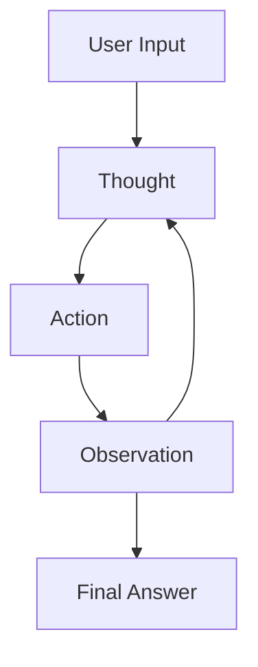

### Characteristics

* Interleaved reasoning and tool usage
* Dynamic decision-making
* Transparent intermediate steps
* Adaptive control flow

### Strengths

* Flexible and expressive
* Effective for exploratory tasks
* Handles unknown environments well

### Limitations

* Token intensive
* Risk of infinite reasoning loops
* Requires termination constraints

### Best Use Cases

* Tool-using assistants
* Research automation
* API orchestration workflows

---

## 2.2 Plan-and-Execute Pattern

**Concept:** Separate planning from execution for clarity and control.

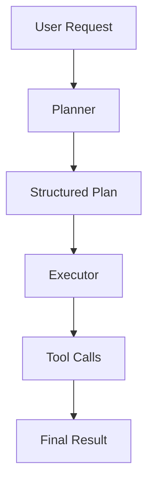

### Key Insight

Decoupling planning from execution reduces reasoning drift and improves observability.

### Advantages

* Explicit task decomposition
* Deterministic execution phase
* Easier debugging and monitoring
* Better suited for long-horizon tasks

### Ideal For

* Enterprise workflow automation
* Multi-step business processes
* Structured orchestration systems

---

## 2.3 Reflexion Pattern (Self-Critique Loop)

**Concept:** The agent critiques and refines its own output before finalization.

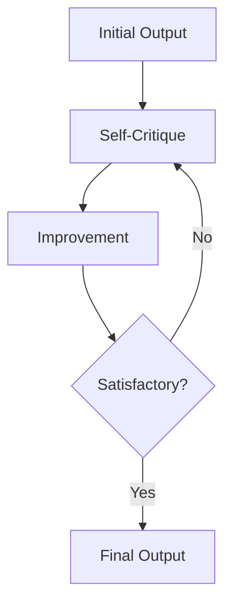

### Benefits

* Improves reasoning depth
* Reduces hallucination risk
* Enhances correctness

### Typical Applications

* Code generation
* Strategic analysis
* Mathematical reasoning
* Complex document drafting

In production systems, this is often implemented as a secondary evaluation model or rule-based validator.

---

## 2.4 Tree-of-Thought (ToT)

**Concept:** Explore multiple reasoning branches before selecting a solution.

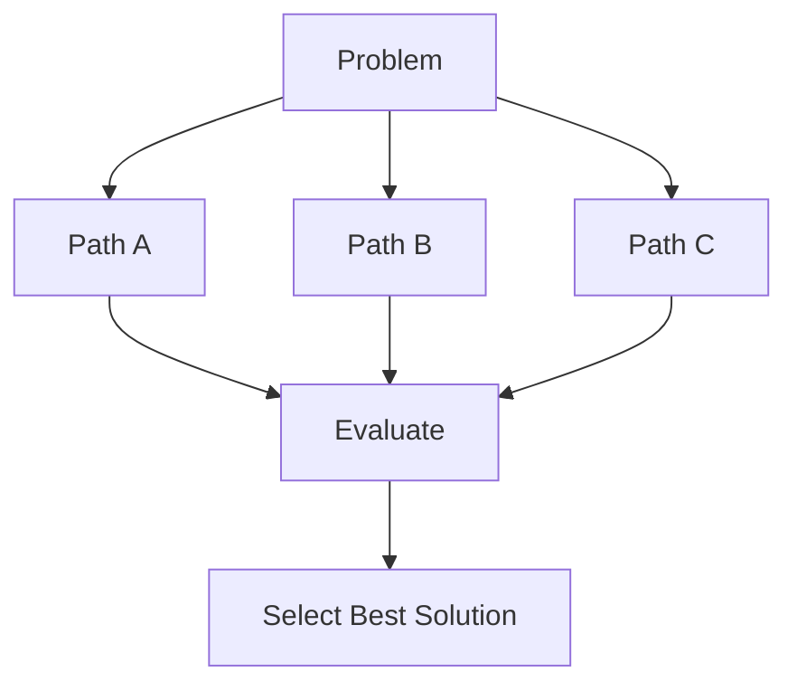

### Why It Matters

Standard chain-of-thought reasoning is linear. Tree-of-Thought expands reasoning into a structured search process.

### Strengths

* Reduces premature convergence
* Improves solution robustness
* Suitable for combinatorial problems

### Trade-Off

* Increased compute cost
* Requires branch evaluation strategy

---

## 2.5 Graph-of-Thought (GoT)

**Concept:** A generalized reasoning graph where ideas merge, branch, and reuse intermediate results.

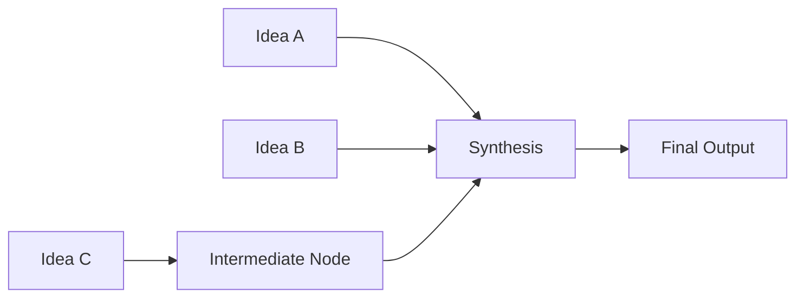

### Distinguishing Features

* Non-linear reasoning
* Reusable intermediate nodes
* Efficient synthesis across branches

This pattern becomes critical in multi-agent and knowledge-intensive environments.

---

# 3. Tool-Using Agent Patterns

---

## 3.1 Tool Augmentation Pattern

Agents extend LLM capabilities via structured tool interfaces.

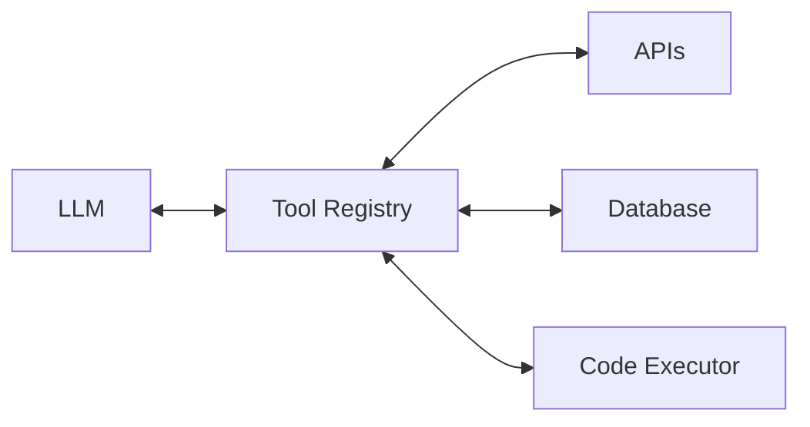

### Core Components

* **Tool registry** (metadata + schemas)
* **Invocation interface**
* **Execution sandbox**
* **Result normalization layer**

Design Principle: The LLM proposes tool usage; the system validates and executes it.

---

## 3.2 Tool Router Pattern

Dynamically selects appropriate tools.

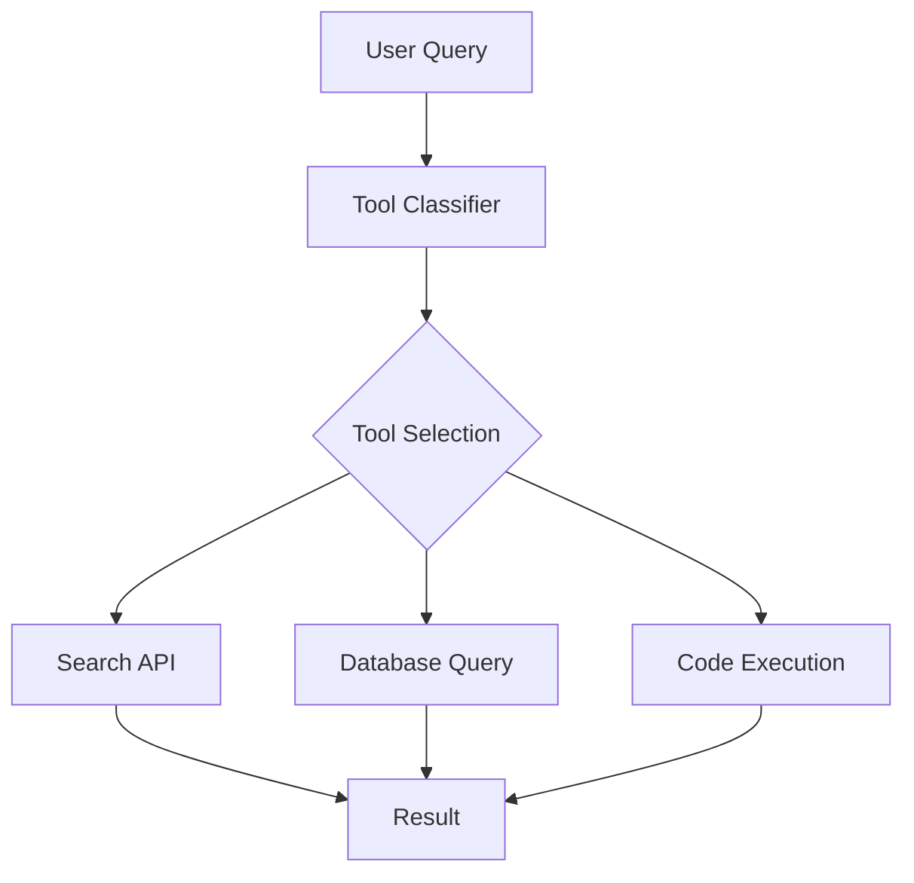

### Routing Strategies

* Rule-based dispatch
* LLM-based classification
* Hybrid systems (rules + model confidence)

Effective routing improves latency, cost efficiency, and reliability.

---

## 3.3 Learned Tool Use (Toolformer-Style)

The model learns when to invoke tools conditionally.

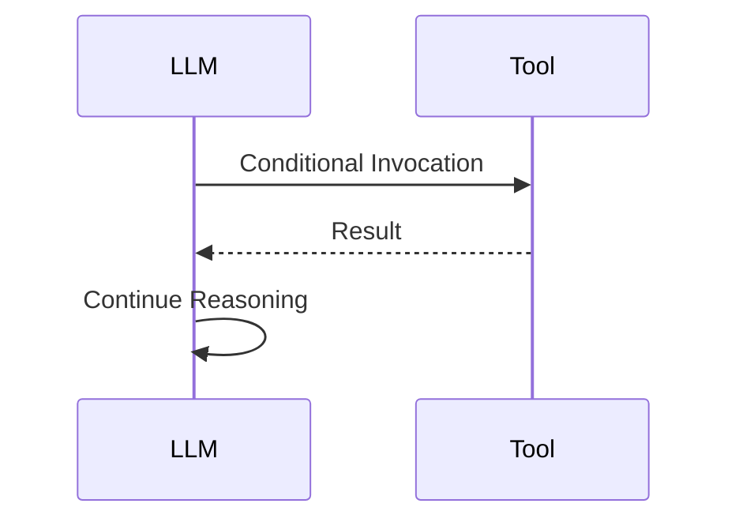

This pattern reduces explicit orchestration complexity and improves autonomy but requires strong validation safeguards.

---

# 4. Memory Design Patterns

---

## 4.1 Memory Layering

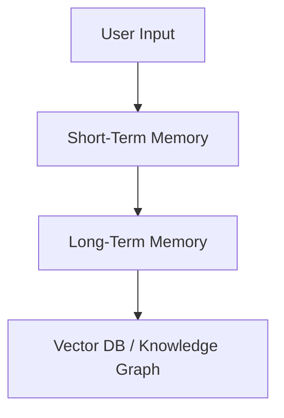

### Memory Types

#### 1. Short-Term Memory

* Conversation context
* Active task state
* Scratchpad reasoning

#### 2. Long-Term Memory

* Vector databases
* Knowledge graphs
* Structured storage systems

#### 3. Episodic Memory

* Past task outcomes
* Feedback signals
* Historical decisions

#### 4. Semantic Memory

* Abstracted factual knowledge
* Domain knowledge independent of sessions

### Design Principle

Memory should be **selective, compressed, and relevance-scored**, not a raw transcript dump.

---

## 4.2 Episodic Learning Loop

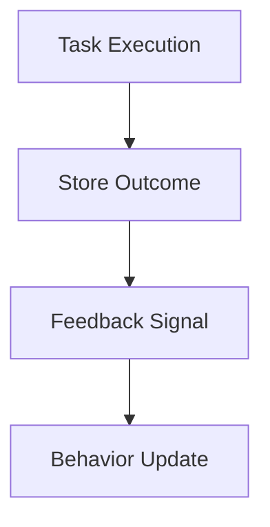

This loop enables adaptive agents that improve over time through reinforcement or fine-tuning mechanisms.

---

# 5. Multi-Agent Design Patterns

---

## 5.1 Manager–Worker Pattern

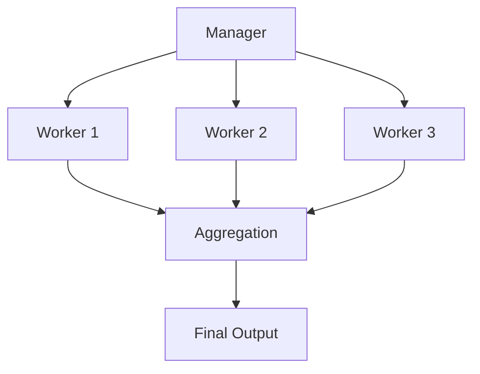

* Manager handles planning
* Workers handle execution
* Aggregator consolidates results

Useful for parallelizable workflows.

---

## 5.2 Debate Pattern

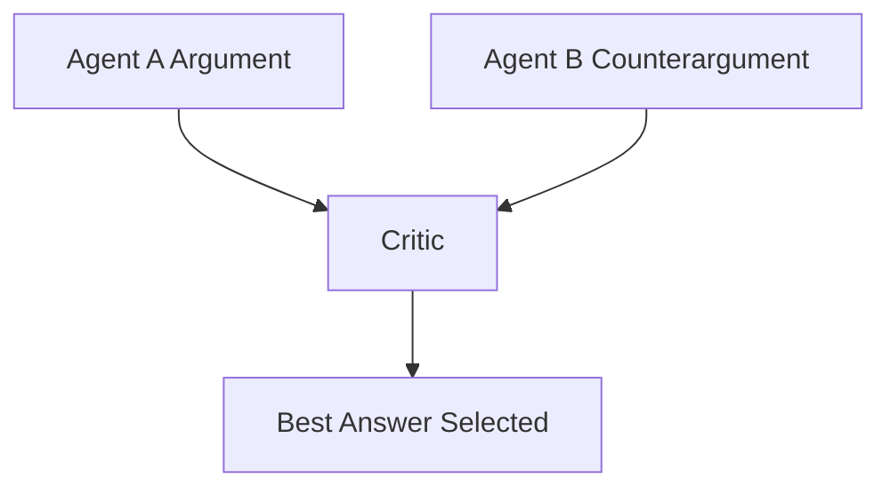

### Purpose

Introduce adversarial reasoning to improve robustness.

### Use Cases

* Policy generation
* Strategic decision-making
* Risk-sensitive outputs

---

## 5.3 Swarm Pattern

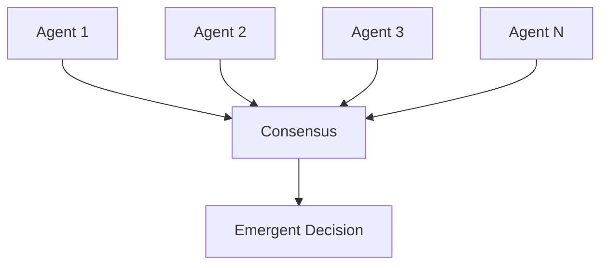

This pattern leverages distributed intelligence and voting or consensus mechanisms.

---

## 5.4 Specialist Agents

Role-based specialization:

* Research agent
* Coding agent
* QA agent
* Compliance agent
* Planning agent

Encapsulation improves modularity and reduces cognitive overload per agent.

---

# 6. Control Flow Patterns

---

## 6.1 Finite State Machine (FSM)

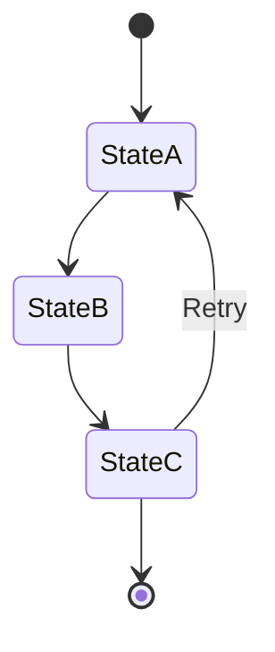

### Benefits

* Deterministic behavior
* Predictable transitions
* Production stability

FSMs are particularly effective in regulated environments.

---

## 6.2 Event-Driven Agent

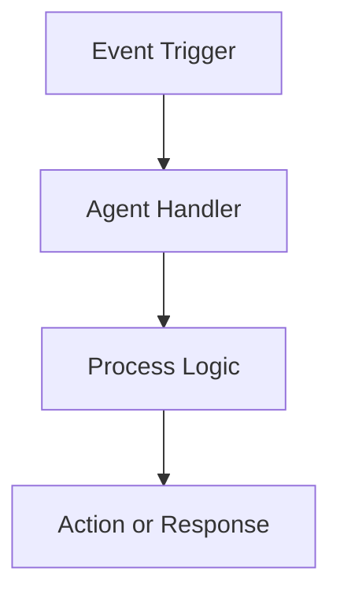

Ideal for real-time systems, messaging platforms, and automation pipelines.

---

## 6.3 Human-in-the-Loop

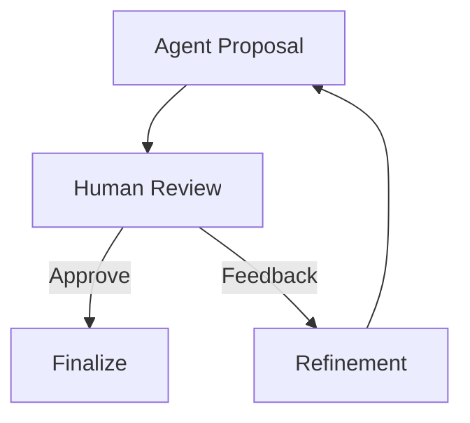

Essential for:

* Regulated industries
* Financial systems
* Medical decision support
* High-risk automation

---

# 7. Planning Patterns

---

## 7.1 Hierarchical Planning

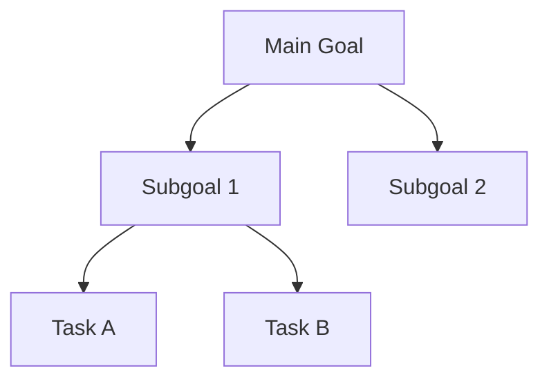

Break high-level objectives into manageable subgoals and atomic tasks.

---

## 7.2 Goal-Oriented Action Planning (GOAP)

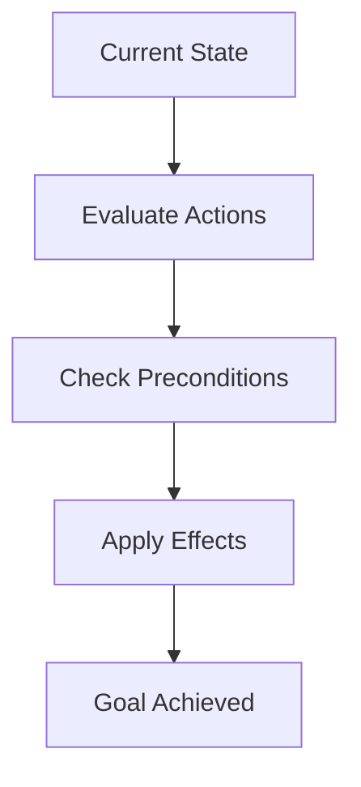

GOAP introduces state-aware reasoning and explicit action effects, enabling dynamic adaptation.

---

# 8. Safety and Reliability Patterns

---

## 8.1 Verification Loop

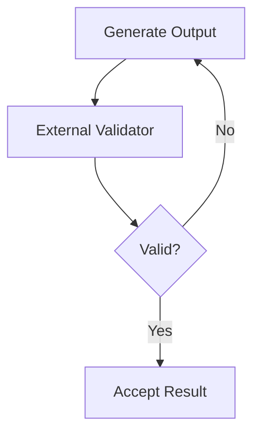

Validators may include:

* Rule engines
* Static analyzers
* Domain-specific checkers
* Secondary LLM evaluators

---

## 8.2 Sandbox Execution

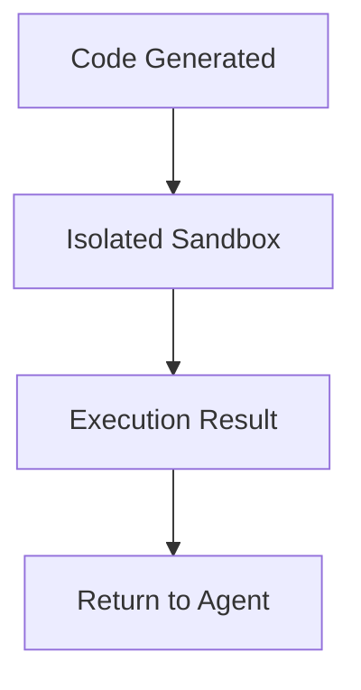

Critical for:

* Code execution
* File manipulation
* External system access

---

# 9. Retrieval-Augmented Agent (RAG)

```mermaid
flowchart TD
    A[User Query] --> B[Retriever]
    B --> C[Relevant Documents]
    C --> D[LLM with Context]
    D --> E[Grounded Response]
```

### Benefits

* Knowledge grounding
* Reduced hallucinations
* Scalable information integration

RAG transforms static LLMs into dynamic, knowledge-aware systems.

---

# 10. Autonomous Agent Loop

```mermaid
flowchart TD
    A[Observe] --> B[Reason]
    B --> C[Plan]
    C --> D[Act]
    D --> E[Reflect]
    E --> A
```

This loop represents the canonical architecture of autonomous agents operating in dynamic environments.

---

# 11. Feedback and Reinforcement

```mermaid
flowchart TD
    A[Action] --> B[Environment]
    B --> C[Reward Signal]
    C --> D[Policy Update]
    D --> A
```

Feedback mechanisms may include:

* Reinforcement learning
* Human preference optimization
* Offline evaluation metrics
* Continuous retraining pipelines

---

# 12. Architectural Decision Matrix

| Dimension   | Option A    | Option B     |
| ----------- | ----------- | ------------ |
| Memory      | Stateless   | Stateful     |
| Execution   | Synchronous | Asynchronous |
| Topology    | Centralized | Distributed  |
| Oversight   | Autonomous  | Human-Guided |
| Planning    | Implicit    | Explicit     |
| Tool Access | Open        | Constrained  |

Selecting along these dimensions defines the operational profile of the agent.

---

# 13. Production Design Principles

1. Separate reasoning from execution
2. Introduce memory incrementally
3. Constrain and validate tool access
4. Add layered verification
5. Log execution traces for observability
6. Monitor latency, token usage, and cost
7. Implement fallback strategies
8. Maintain human oversight in high-risk domains

Production agents are engineered systems, not prompt experiments.

---

# 14. Emerging Trends

* Persistent autonomous agents
* Long-horizon task automation
* Agent ecosystems
* Cross-agent collaboration protocols
* Self-improving reasoning architectures
* Hybrid symbolic-neural systems

---

# 15. Conclusion

AI agents are **architectural systems** that integrate reasoning, memory, tools, planning, safety, and coordination.

Robust agents combine:

* Iterative reasoning patterns (ReAct, Reflexion, ToT)
* Structured planning mechanisms
* Layered memory systems
* Multi-agent coordination
* Verification and safety loops

Designing production-grade agents requires deliberate trade-offs across compute, latency, reliability, autonomy, and safety. The most effective systems are modular, observable, constrained, and continuously evaluated.

Agent engineering is not about chaining prompts. It is about designing controlled, adaptive, and verifiable intelligent systems.
