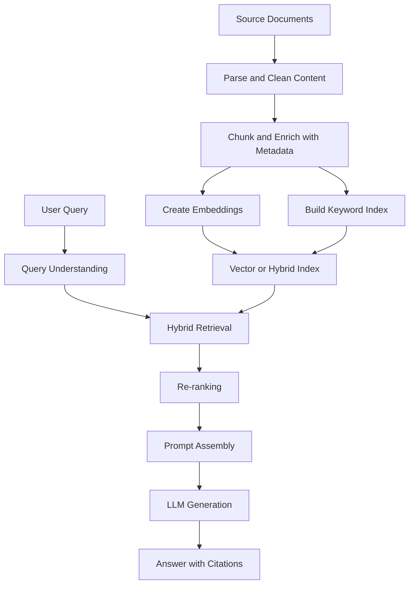
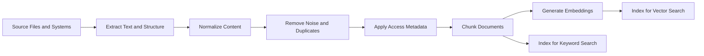
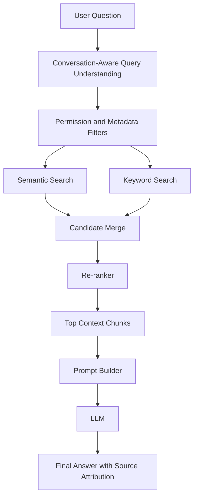
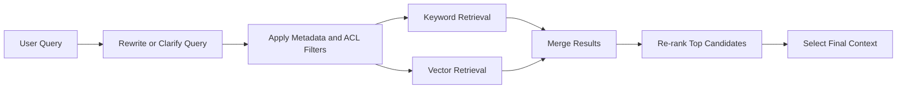

# Building an AI Chatbot with RAG: From Fundamentals to System Design

*From First Principles to Production-Ready Retrieval-Augmented Generation Systems*

---

Retrieval-Augmented Generation, or RAG, is one of the most practical ways to build useful AI chatbots. It gives a language model access to external knowledge at the moment a user asks a question, instead of forcing the model to rely only on what it learned during training. That simple change has major consequences: answers can be grounded in your documents, updated when your content changes, and restricted to the information a user is allowed to see.

This article rebuilds RAG from first principles and then walks forward into production system design. It is written for beginners, but it does not flatten the engineering reality. A modern RAG chatbot is not just "embed files and ask an LLM." It is a retrieval system, a prompt construction system, a security boundary, and an evaluation problem operating together.

If you want a stack-specific companion article that explains how to choose concrete tools for each layer, see [RAG System Design with Selected Stack and Demo](/rag/2026/03/25/building-a-rag-chatbot-how-to-choose-each-component-and-why.html).

---

## 1. Introduction

### What RAG is

RAG is an application pattern where a system:

1. Receives a user query.
2. Retrieves relevant information from an external knowledge source.
3. Supplies that retrieved context to a language model.
4. Generates an answer that is grounded in that context.

The external source might be product manuals, a company wiki, support tickets, contracts, policies, database records, or web content. The key idea is that the model answers with help from retrieved evidence instead of relying purely on memory.

### Why RAG matters

Traditional large language models are powerful, but they have three common limitations:

- They may not know your private data.
- Their knowledge can be outdated.
- They can produce fluent but unsupported answers.

RAG addresses all three. It lets you connect the model to knowledge that is:

- Private
- Frequently updated
- Domain-specific
- Permission-controlled
- Traceable to a source

For many enterprise and knowledge-assistant use cases, RAG is the default starting point because updating documents is much cheaper and safer than retraining or fine-tuning a model every time the source material changes.

### Problems RAG solves compared with a plain LLM

Think of a plain LLM like a smart employee taking an exam from memory. A RAG system is the same employee with access to a well-organized library and a search assistant.

RAG improves:

- Factual grounding: answers can be tied to retrieved evidence.
- Freshness: updating the corpus updates the assistant.
- Control: the assistant can be limited to approved sources.
- Transparency: the UI can show citations and source passages.
- Maintainability: knowledge updates happen through data pipelines, not model retraining.

RAG does not guarantee truth, and it does not remove the need for careful engineering. If retrieval is poor, the final answer will still be poor. In practice, retrieval quality is often the first and biggest bottleneck.

---

## 2. Core Concepts

### Embeddings

Embeddings are numeric vector representations of text. They map semantically similar text closer together in vector space, which makes similarity search possible.

For example, a user query like "How do I reset my password?" and a document chunk titled "Account password recovery" may not share the exact same words, but a good embedding model can still place them near each other because they mean similar things.

Embeddings are typically used for:

- Semantic search
- Clustering
- Classification
- Recommendation

In RAG, the most common pattern is:

1. Split documents into chunks.
2. Generate an embedding for each chunk.
3. Store those vectors in a vector-capable index.
4. Embed the user query at runtime.
5. Retrieve the nearest chunks.

Important nuance: embeddings help with semantic matching, but they are not enough by themselves. They are weak on exact identifiers, codes, numbers, and some domain-specific terminology. That is one reason hybrid retrieval has become the dominant production pattern.

### Vector databases

A vector database stores embeddings and supports nearest-neighbor search. In practice, many modern search platforms now combine vector search, keyword search, metadata filtering, and ranking in one engine. So when people say "vector database," the real production choice is often broader: a vector database or a search engine with vector capabilities.

A good retrieval store should support:

- Fast similarity search
- Metadata filtering
- Hybrid search
- Incremental updates and deletes
- Multi-tenant isolation where needed
- Operational visibility

The database is not the intelligence of the system. It is an index. The intelligence comes from how documents are prepared, how retrieval is configured, and how the model is prompted with the results.

### Chunking strategies

Chunking means splitting documents into smaller units before indexing them. This is one of the highest-impact decisions in a RAG system.

If chunks are too small:

- Important context gets split apart.
- Retrieval returns fragments with missing meaning.

If chunks are too large:

- Retrieval becomes less precise.
- Prompt cost rises.
- Irrelevant text crowds out useful evidence.

The goal is not "small chunks" or "large chunks." The goal is semantically coherent chunks that still fit well into retrieval and prompting constraints.

Common chunking strategies include:

- Fixed-size chunking by tokens or characters
- Sliding-window chunking with overlap
- Structure-aware chunking based on headings, sections, tables, or paragraphs
- Semantic chunking that tries to preserve meaning boundaries

For most document-heavy systems, structure-aware chunking is better than naive fixed windows because it respects how humans organize information. Overlap is often useful, but too much overlap creates redundancy and can pollute retrieval results.

For a component-level discussion of why a system might choose semantic chunking specifically, see [RAG System Design with Selected Stack and Demo](/rag/2026/03/25/building-a-rag-chatbot-how-to-choose-each-component-and-why.html).

### Retrieval methods

#### Semantic retrieval

Semantic retrieval uses embeddings to find meaning-related content. It is strong when a query and the relevant document use different wording.

Example:

- Query: "How do I offboard an employee?"
- Document: "Termination checklist for HR operations"

Keyword search may miss that match. Semantic search may find it.

#### Keyword retrieval

Keyword retrieval relies on lexical matching, often with scoring methods such as BM25. It is strong when the user includes:

- Product names
- Error codes
- Legal clauses
- Exact field names
- Technical identifiers

Example:

- Query: "ERR-8492 in billing sync"

Keyword search can outperform pure vector search here because exact strings matter.

#### Hybrid retrieval

Hybrid retrieval combines semantic search and keyword search. This is often the best default for production because real user questions contain both meaning and exact terms.

Modern search systems often merge these result lists using rank fusion, then optionally rerank the merged set with a stronger ranker.

If you are building a serious RAG chatbot today, hybrid retrieval is usually a better starting point than dense-only retrieval.

For an applied example that pairs hybrid retrieval with ChromaDB and a separate keyword layer, see [RAG System Design with Selected Stack and Demo](/rag/2026/03/25/building-a-rag-chatbot-how-to-choose-each-component-and-why.html).

### Re-ranking

Retrieval normally happens in stages:

1. A fast first-stage retriever fetches candidate chunks.
2. A stronger reranker reorders those candidates by likely relevance.

Rerankers are useful because first-stage retrieval is optimized for speed, not perfect ranking. A reranker can examine the query and candidate passages more carefully and promote the chunks that are actually most helpful.

This matters because the LLM sees only a limited number of chunks. If the wrong chunks are passed into the prompt, generation quality falls even if the correct answer exists somewhere in the database.

For a concrete reranking choice and rationale using ColBERT, see [RAG System Design with Selected Stack and Demo](/rag/2026/03/25/building-a-rag-chatbot-how-to-choose-each-component-and-why.html).

### The LLM's role in RAG

The language model is the final synthesizer, not the search engine. Its job is to:

- Read the retrieved evidence
- Combine it with the conversation context
- Answer clearly
- Stay within the support of the sources
- Acknowledge uncertainty when evidence is missing

The model should not be treated as a substitute for retrieval. In a healthy RAG pipeline:

- Search finds the evidence.
- Ranking selects the best evidence.
- The model explains or synthesizes the evidence.

That separation of responsibilities is one of the most important design principles in RAG.

---

## 3. System Architecture

### The end-to-end RAG pipeline

At a systems level, RAG has two major flows:

- An offline ingestion flow that prepares knowledge for retrieval
- An online query flow that answers user questions

This conceptual architecture is complemented by [RAG System Design with Selected Stack and Demo](/rag/2026/03/25/building-a-rag-chatbot-how-to-choose-each-component-and-why.html), which maps these same layers to a specific tool stack.

### Stage 1: Data ingestion

Data ingestion is the process of collecting source material and converting it into indexable text.

Typical sources include:

- PDFs
- HTML pages
- Markdown files
- Internal wikis
- Support tickets
- Database exports
- Knowledge base articles

The goal is not just extraction. The goal is clean, structured, trustworthy content. If the source text is noisy, duplicated, incomplete, or permissionless, retrieval quality will suffer later.

### Stage 2: Processing and enrichment

Once content is extracted, it should be enriched before indexing. This usually includes:

- Document title
- Source URL or file path
- Section heading
- Product or department label
- Language
- Creation date or effective date
- Access-control metadata

Metadata is not optional decoration. It is a major part of retrieval quality and security. It enables:

- Filtering by tenant or user permission
- Restricting search to a product or department
- Biasing retrieval toward newer content when appropriate
- Better citations in the final answer

### Stage 3: Storage and indexing

The processed content is then stored in one or more indexes:

- A vector index for semantic retrieval
- A keyword index for lexical retrieval
- Metadata fields for filtering and ranking

This is why a hybrid-capable search stack is so useful. It lets one system handle semantic similarity, exact-match retrieval, and permission filtering together.

### Stage 4: Query-time retrieval

At runtime, the system receives a user question and converts it into a retrieval task.

That usually involves:

- Normalizing the query
- Optionally rewriting or expanding it
- Applying permission filters
- Running hybrid retrieval
- Reranking candidates
- Selecting the final context window

### Stage 5: Generation

The prompt sent to the model usually contains:

- A system instruction
- The user question
- Relevant conversation history
- Retrieved context passages
- Answer rules such as citation formatting, refusal behavior, and grounding requirements

The generation step should be designed to reward restraint. If the evidence is weak or contradictory, the model should say so rather than overconfidently inventing an answer.

## 4. Step-by-Step Implementation

This section moves from concept to build sequence. Each step explains what to do, why it matters, and how to approach it.

---

### Step 1: Define the use case and trust boundary

**What:** Choose the exact job the chatbot must do and the data it is allowed to use.

**Why:** RAG systems fail quickly when their scope is vague. "Answer any company question" is not a useful first target. "Answer employee benefits questions from approved HR policy documents" is much more workable.

**How:** Define:

- The user group
- The set of approved sources
- The required freshness
- Whether citations are mandatory
- What the assistant should do when no answer is found

This step also defines the trust boundary. If different users have different document permissions, design for access control now, not later.

### Step 2: Gather and clean the source data

**What:** Collect the documents or records the assistant will use.

**Why:** A RAG system is only as reliable as its corpus. Outdated, duplicated, conflicting, or badly parsed documents create misleading retrieval results.

**How:** For each source, answer:

- Is it authoritative?
- Is it current?
- Does it overlap with another source?
- Can it be parsed cleanly?
- Does it contain sensitive data that needs filtering?

Prefer a smaller, clean corpus over a large, messy one. Precision beats volume in the early stages.

### Step 3: Parse documents and preserve structure

**What:** Extract text while keeping document structure such as titles, headings, lists, and tables where possible.

**Why:** Structure is a major signal for chunking and relevance. A heading like "Refund Policy" tells the system far more than raw paragraphs alone.

**How:** Use parsers that preserve:

- Document titles
- Section hierarchy
- Table content when relevant
- Source identifiers
- Page or section references for citations

If the content is highly structured, such as legal policies or product docs, preserving layout can improve retrieval significantly.

### Step 4: Chunk the content

**What:** Split content into retrieval units.

**Why:** The retriever does not search whole books well. It searches chunks. The chunk is the actual unit of retrieval quality.

**How:** Start with these rules:

- Keep chunks semantically coherent.
- Preserve section boundaries when possible.
- Use modest overlap only where it helps continuity.
- Store parent-child relationships when documents are large.

A useful practical approach is:

- Parent document: a section or article
- Child chunk: a smaller piece indexed for retrieval

At query time, retrieve child chunks but optionally return the surrounding parent context to the model. This often improves answer quality without making the retriever too coarse.

### Step 5: Attach metadata

**What:** Add structured metadata to every chunk.

**Why:** Metadata improves ranking, filtering, permissions, and traceability.

**How:** Typical fields include:

- `document_id`
- `title`
- `section`
- `source_url`
- `created_at`
- `effective_date`
- `product`
- `department`
- `access_scope`
- `language`

This is also where you attach ACL or tenant metadata so unauthorized content never enters the candidate set for a user.

### Step 6: Generate embeddings and build the index

**What:** Create vector representations for chunks and store them in a searchable index.

**Why:** This enables semantic retrieval, which is essential for matching related meaning instead of exact wording only.

**How:** Choose an embedding model based on:

- Retrieval quality on your domain
- Language support
- Latency
- Cost
- Vector dimension and storage impact

Then build:

- A vector index for semantic search
- A keyword index for exact matching
- Metadata fields for filtering

In production, do not force a false choice between vector and keyword retrieval. Build for both unless you have strong evidence that one is unnecessary.

### Step 7: Build the retrieval pipeline

**What:** Implement the runtime search logic.

**Why:** The best corpus in the world is useless if query-time retrieval is weak.

**How:** A strong baseline pipeline is:

1. Normalize the user query.
2. Use conversation history to resolve references like "that policy" or "the last one."
3. Apply permission filters.
4. Run hybrid retrieval.
5. Rerank the top candidates.
6. Select the final chunks for prompt assembly.

The reason for reranking is simple: first-stage retrieval is fast but imperfect. A reranker helps ensure the model sees the best evidence, not just the fastest approximate matches.

### Step 8: Assemble the prompt carefully

**What:** Build the final prompt the model will receive.

**Why:** Even with good retrieval, a sloppy prompt can make the model ignore evidence, over-answer, or mix relevant and irrelevant context.

**How:** The prompt should usually include:

- A clear instruction to answer using the provided context
- A rule to say when the answer is not supported by the sources
- A format for citations or source references
- The user question
- The selected chunks

Avoid dumping too many chunks into the prompt. More context is not always better. Past a certain point, extra context becomes noise.

### Step 9: Generate the answer and return citations

**What:** Call the LLM and produce the final user response.

**Why:** The model turns retrieved evidence into a readable, useful answer.

**How:** Require the answer to:

- Prefer retrieved evidence over prior knowledge
- Cite sources when supported
- State uncertainty when evidence is incomplete
- Refuse or narrow the answer when no relevant source is found

For knowledge assistants, a correct "I could not find enough evidence in the approved sources" is often better than a plausible but unsupported answer.

### Step 10: Evaluate and iterate

**What:** Measure the system continuously.

**Why:** RAG quality cannot be judged reliably by intuition alone. Teams often overestimate quality based on a few good demos.

**How:** Evaluate at three levels:

- Retrieval quality: did the system retrieve the right chunks?
- Answer quality: was the response correct, grounded, and complete?
- System quality: was latency, cost, and reliability acceptable?

Useful metrics include:

- Recall at k
- Precision at k
- Mean reciprocal rank
- Citation correctness
- Answer faithfulness to sources
- End-to-end latency
- Cost per query

Human review is still necessary, especially for domain-specific or high-stakes use cases.

---

## 5. Improvements and Best Practices

### Use hybrid retrieval by default

Dense-only retrieval is attractive because it feels modern, but it often underperforms on exact terms. Keyword-only retrieval misses semantic matches. Hybrid search is usually the most reliable baseline.

### Add reranking before generation

A reranker is one of the highest-leverage upgrades you can make after basic retrieval works. It improves the quality of the context window without changing the underlying corpus.

### Treat chunking as a product decision, not a preprocessing detail

Chunking determines what can be retrieved, cited, and understood. Different content types need different strategies:

- API docs often benefit from section-aware chunks.
- Policies benefit from heading-preserving chunks.
- Support tickets may need case-level grouping.
- Tables may need custom serialization.

### Enforce access control inside retrieval, not after it

Do not retrieve all content and filter it later in the prompt layer. Unauthorized chunks should never enter the candidate set for a user.

### Prefer high-quality context over more context

Many systems fail by sending too many chunks. The model gets a larger prompt but a worse signal-to-noise ratio. Good ranking beats large context windows.

### Design for no-answer behavior

Every production chatbot needs a graceful failure path. If the evidence is weak or absent, the assistant should:

- Say that it could not find enough support
- Ask a clarifying question
- Suggest where the user can look next

Silence and invention are both worse than explicit uncertainty.

### Evaluate retrieval separately from generation

If a user gets a bad answer, you need to know whether the problem came from:

- Bad corpus quality
- Bad chunking
- Weak retrieval
- Poor ranking
- Poor prompt design
- Model behavior

Without stage-level evaluation, teams often change prompts when the real problem is indexing.

### Keep the ingestion and query paths separate

The offline path prepares data. The online path answers questions. Mixing these concerns creates brittle systems and makes scaling harder.

### Plan for updates and deletions

Production corpora change. Your system must support:

- Re-indexing updated documents
- Removing deleted or invalid content
- Handling version history
- Preventing stale chunks from lingering in search results

### Add observability from day one

Log enough detail to answer questions such as:

- What query rewrite was used?
- Which chunks were retrieved?
- Which chunks were passed to the LLM?
- What sources were cited?
- Why did a no-answer response occur?

Without retrieval logs, debugging RAG becomes guesswork.

## Common Pitfalls

### Treating RAG as "LLM plus vector database"

That view is too shallow. Real systems need parsing, chunking, metadata, ACL filtering, ranking, prompting, evaluation, and operations.

### Using poor source material

If your corpus contains duplicated, stale, or conflicting documents, the chatbot will reflect that confusion.

### Ignoring exact-match needs

Many enterprise questions involve version numbers, codes, legal terms, or product names. Pure semantic search often misses these.

### Overstuffing the prompt

Large context windows do not remove the need for ranking. They only raise the cost ceiling.

### Skipping evaluation

Good demos are not proof of quality. RAG systems need repeatable test sets and failure analysis.

## Scaling Considerations

As the system grows, new concerns appear:

- Multi-tenant isolation
- Access-aware indexing
- Caching popular queries or retrieved contexts
- Cost management for embedding and generation
- Sharding or partitioning large indexes
- Background reprocessing pipelines
- SLA targets for latency and availability

At scale, the architecture often includes:

- Dedicated ingestion workers
- Queue-based document processing
- Versioned indexes
- Separate services for retrieval and generation
- Offline evaluation pipelines

The underlying idea stays the same, but operational discipline becomes much more important.

---

## 6. Conclusion

RAG matters because it turns a language model from a general reasoner into a grounded assistant. It gives the model access to external knowledge at runtime, which improves freshness, transparency, and control.

The most important lesson is that good RAG is mostly a retrieval and data-engineering problem before it becomes a prompting problem. Strong source selection, structure-aware chunking, hybrid retrieval, reranking, access control, and systematic evaluation matter more than clever prompt wording alone.

Use RAG when:

- The knowledge changes often
- The data is private or domain-specific
- Users need answers tied to sources
- You need more control than a base model can provide

Consider alternatives or additions when:

- The task is mostly action-taking rather than knowledge retrieval
- The answer depends on real-time transactional data from APIs or databases
- You need highly specialized behavior or style that retrieval alone cannot provide
- A workflow needs tools, agents, or structured execution rather than document Q and A

In practice, modern systems often combine RAG with tools, structured data access, and workflow orchestration. But for knowledge-grounded chatbots, RAG remains the core architecture because it solves the most important problem first: giving the model the right information before it speaks.

## References for Validation

The architectural choices in this article align with current vendor and research guidance on embeddings, chunking, hybrid retrieval, and semantic reranking:

- OpenAI embeddings guide: https://platform.openai.com/docs/guides/embeddings
- Azure AI Search semantic chunking guidance: https://learn.microsoft.com/en-us/azure/search/search-how-to-semantic-chunking
- Azure AI Search semantic ranking guidance: https://learn.microsoft.com/en-us/azure/search/search-get-started-semantic
- Original RAG paper by Lewis et al.: https://arxiv.org/abs/2005.11401
