# Building a RAG Chatbot: How to Choose Each Component and Why

*A Practical Guide to Selecting and Integrating RAG Pipeline Components*

---

Retrieval-Augmented Generation, or RAG, is one of the most practical ways to build a useful AI chatbot. It combines retrieval with generation so the model can answer from external knowledge instead of relying only on training-time memory. That makes the system more current, more controllable, and easier to align with private or domain-specific data.

The hard part is not understanding the basic idea. The hard part is selecting the right components for the pipeline. A real RAG system is made of multiple layers: document ingestion, parsing, chunking, embeddings, storage, retrieval, reranking, and generation. Every one of those layers introduces trade-offs in quality, cost, speed, and engineering complexity.

This article starts from the system view of RAG, walks through the major implementation options for each component, and then explains why this project selects the following final stack:

- Document loader: `Docling`
- Chunking strategy: `Semantic chunking`
- Embedding model: `bge-large-en`
- Vector database: `ChromaDB`
- Retrieval strategy: `Hybrid search`
- Web scraping tool: `Playwright`
- Reranking: `ColBERT`
- LLMs: `Groq GPT-OSS 120B` and `Groq DeepSeek-R1` with runtime toggle support

The goal here is not just to list tools. It is to show how each choice fits into the full architecture and why it was selected over the alternatives.

For the broader conceptual explanation of how RAG works from first principles through system design, see [Building an AI Chatbot with RAG From Fundamentals to System Design](/rag/2026/03/20/building-an-ai-chatbot-with-rag-from-fundamentals-to-system-design.html).

---

## 1. What a RAG Chatbot Actually Does

A RAG chatbot combines search and generation in a single pipeline. Instead of asking the model to answer from memory, the system first retrieves relevant content and then gives that content to the model as evidence.

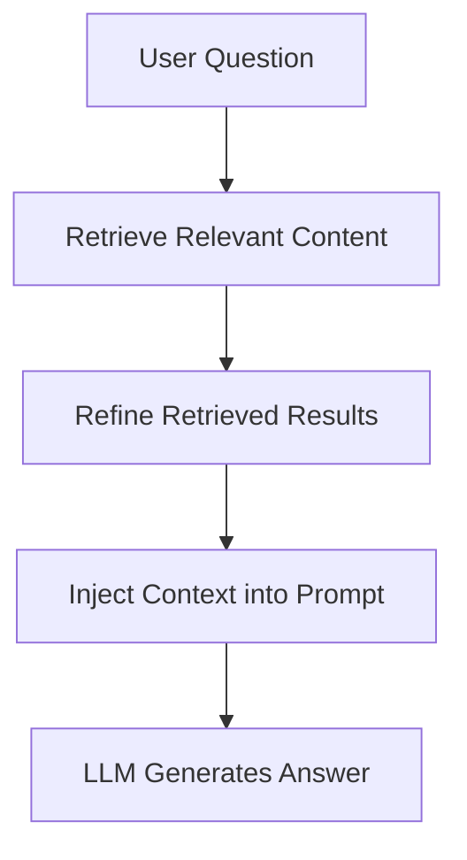

This changes the role of the model. In a healthy RAG system, the model is not the search engine. It is the final synthesizer. Retrieval finds evidence, reranking improves that evidence, and the model explains or combines it into a useful answer.

That distinction matters because many RAG failures are not generation failures. They are retrieval failures. If the system retrieves weak or irrelevant context, even a strong model will produce a weak answer.

That system-level separation of responsibilities is explained in more depth in [Building an AI Chatbot with RAG From Fundamentals to System Design](/rag/2026/03/20/building-an-ai-chatbot-with-rag-from-fundamentals-to-system-design.html).

---

## 2. Why RAG Systems Need Careful Component Selection

RAG is attractive because it solves several problems that plain LLM applications struggle with:

- answers can be grounded in real documents
- knowledge can be updated without retraining
- private information can stay outside the base model
- citations and source visibility become possible

But RAG is not one technology. It is a chain of technologies, and the output quality depends on the weakest link in that chain.

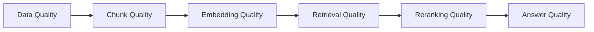

That is why component selection matters. A good vector database will not fix poor parsing. A good LLM will not fix poor retrieval. A strong reranker cannot recover information that never made it into the index in the first place.

---

## 3. The Full RAG Pipeline

A production-style RAG chatbot usually has two major flows: ingestion and query-time answering.

This section is the stack-specific companion to the architecture discussion in [Building an AI Chatbot with RAG From Fundamentals to System Design](/rag/2026/03/20/building-an-ai-chatbot-with-rag-from-fundamentals-to-system-design.html).

### Ingestion Pipeline

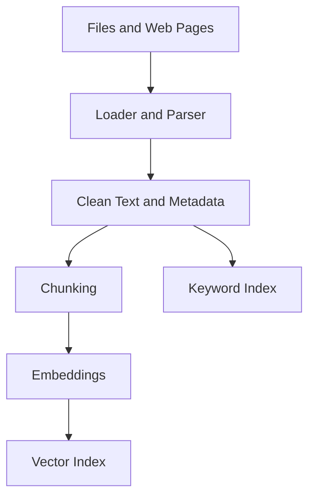

### Query Pipeline

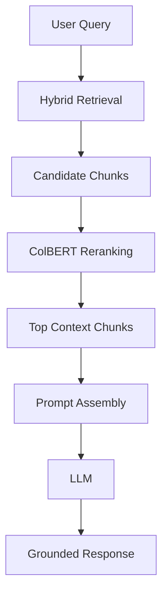

These flows are tightly connected. Better document parsing improves chunking. Better chunking improves embeddings. Better embeddings improve first-stage retrieval. Better retrieval gives the reranker stronger candidates. Better reranked context gives the model a better chance of producing a correct answer.

---

## 4. Choosing the Document Loader: Why Docling

The first major decision is how raw files become machine-usable text. This layer is often underestimated, but it has direct downstream impact on the entire system.

### Loader Comparison

| Tool | Type | Output Quality | Structure Awareness | Notes |
| --- | --- | --- | --- | --- |
| Manual loader | Custom | High | Medium | Full control |
| LlamaIndex loaders | Framework | Medium | Medium | Plug-and-play |
| LangChain loaders | Framework | Medium | Medium | Integrations |
| Unstructured | Parsing lib | High | High | Complex docs |
| Docling | Parser | High | High | Structured content |
| LlamaParse | Managed | Very High | Very High | Paid |
| Apache Tika | General parser | Medium | Low | Broad formats |

The comparison shows a clear pattern. Simple loaders are easy to wire up, but they usually preserve less structure. Managed parsers can produce excellent output, but they introduce external dependency and cost. General parsers support many formats, but they often flatten documents too aggressively for high-quality retrieval.

`Docling` is the selected choice because it gives a strong balance:

- high output quality
- high structure awareness
- no mandatory paid service
- strong fit for PDFs and complex documents

That balance matters because structure improves retrieval. Headings, sections, tables, and document boundaries all influence how chunks should be formed. If the parser destroys that structure too early, the later stages have to guess at meaning that was already available in the source.

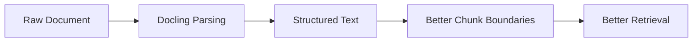

For this reason, the loader is not just an ingestion utility. It is a quality gate for the entire RAG pipeline.

---

## 5. Choosing the Web Ingestion Tool: Why Playwright

Some knowledge lives in files. Some lives on websites. Modern websites often render important content through JavaScript, so basic static scraping is not always enough.

### Web Scraping Comparison

| Tool | JS Support | Speed | Resource | Notes |
| --- | --- | --- | --- | --- |
| requests + BeautifulSoup | No | Fast | Low | Static sites |
| Scrapy | No | Fast | Low | Large-scale |
| Playwright | Yes | Medium | Medium-High | Dynamic sites |
| Selenium | Yes | Slow | High | Legacy |
| Puppeteer | Yes | Medium | Medium | Node-based |

`Playwright` is selected because this system needs reliable handling of dynamic web pages. It is not the lightest option, but it is the most practical when content is rendered client-side, requires interaction, or appears behind navigation and authenticated flows.

That makes it a better choice than static HTML scraping for modern documentation sites and application-driven content.

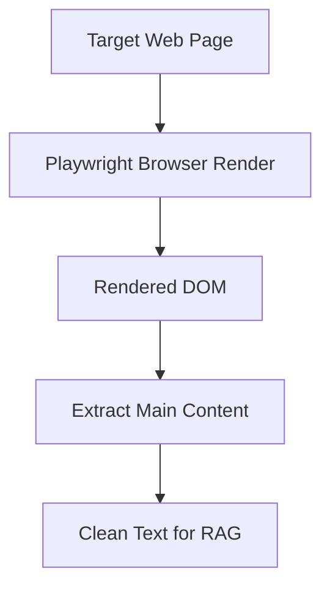

The trade-off is clear: more capability costs more compute. That means Playwright should be used intentionally for dynamic pages, not as the default for every URL.

---

## 6. Choosing the Chunking Strategy: Why Semantic Chunking

Chunking is one of the highest-impact decisions in a RAG system. If chunks are too small, useful meaning gets split apart. If they are too large, retrieval becomes noisy and prompt cost rises.

### Chunking Comparison

| Strategy | Quality | Complexity | Notes |
| --- | --- | --- | --- |
| Fixed-size | Medium | Low | Simple |
| Recursive | High | Low-Medium | Structured |
| Token-based | High | Medium | LLM-aligned |
| Markdown/code-aware | High | Medium | Docs |
| Semantic | Very High | High | Meaning-based |
| Structure-based | Very High | Medium | Sections |

`Semantic chunking` is selected because the system is optimized for answer quality, not just implementation convenience. Semantic chunking tries to preserve natural meaning boundaries instead of cutting text at arbitrary token or character counts.

That gives it two major advantages:

- it reduces context fragmentation
- it improves the chance that retrieved chunks actually contain complete thoughts

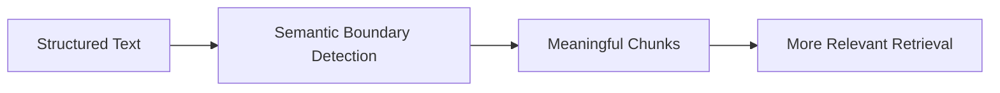

This choice has a real cost. Semantic chunking is more complex than fixed-size or recursive splitting, and it needs tuning. But for a RAG system where retrieval quality is a priority, that extra complexity is justified.

The best practical interpretation here is not to ignore structure. The parser should first preserve structure, and semantic chunking should operate with that structure in mind. In other words, `Docling` and semantic chunking reinforce each other.

That relationship between document structure and chunk quality is also discussed conceptually in [Building an AI Chatbot with RAG From Fundamentals to System Design](/rag/2026/03/20/building-an-ai-chatbot-with-rag-from-fundamentals-to-system-design.html).

---

## 7. Choosing the Embedding Model: Why bge-large-en

Embeddings turn chunks into vector representations so semantically similar content can be retrieved together.

### Embedding Comparison

| Model | Type | Quality | Speed | Cost |
| --- | --- | --- | --- | --- |
| MiniLM | Open-source | Medium-High | Fast | Free |
| BGE | Open-source | High | Medium | Free |
| OpenAI embeddings | API | Very High | Medium | Paid |
| Voyage AI | API | Very High | Medium | Paid |

The selected model is `bge-large-en`.

This choice reflects a practical middle path. API-based embeddings can be excellent, but they add recurring cost and an external dependency. Smaller open models are faster, but they can give up some retrieval quality.

`bge-large-en` is selected because it offers:

- strong open-source embedding quality
- good semantic retrieval performance for English
- no mandatory API cost

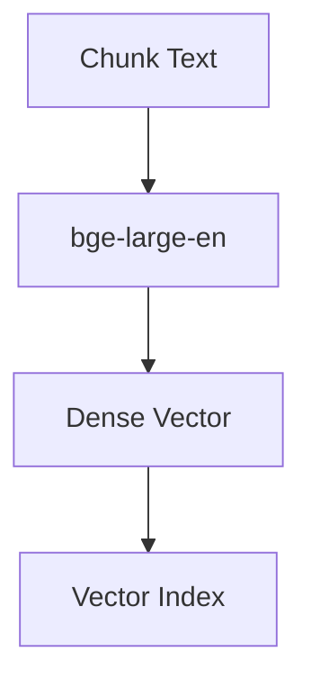

The trade-off is compute. Larger local embedding models are heavier than smaller alternatives. But since this system is optimizing for retrieval quality while staying self-managed, that is a reasonable exchange.

---

## 8. Choosing the Vector Database: Why ChromaDB

Once chunks are embedded, they need to be indexed and retrieved efficiently.

### Vector Database Comparison

| Tool | Type | Scalability | Complexity | Cost |
| --- | --- | --- | --- | --- |
| FAISS | Library | Low | Low | Free |
| ChromaDB | Local DB | Medium | Low | Free |
| Qdrant | Vector DB | High | Medium | Free/Paid |
| Pinecone | Managed | Very High | Low | Paid |
| Weaviate | Vector DB | High | High | Free/Paid |
| pgvector | PostgreSQL extension | Medium | Medium | Low |

`ChromaDB` is selected because it keeps infrastructure simple while still supporting a practical RAG workflow.

It fits this project well because it offers:

- low setup complexity
- local-first development
- enough capacity for prototypes and small-to-medium deployments
- easy iteration while the retrieval logic is still evolving

This is a deliberately pragmatic choice. If the system later needs larger scale, stricter production features, or more advanced distributed behavior, it can move to a system like Qdrant or a managed platform. But that is a scaling decision, not a starting decision.

---

## 9. Choosing the Retrieval Strategy: Why Hybrid Search

Dense vector retrieval is strong for meaning, but weak for exact identifiers, codes, numbers, and specific strings. Keyword search has the opposite profile. Real queries often need both.

### Retrieval Comparison

| Strategy | Accuracy | Latency | Complexity |
| --- | --- | --- | --- |
| Similarity search | Medium-High | Low | Low |
| Hybrid search | High | Medium | Medium |
| Multi-query | High | Medium-High | Medium |

`Hybrid search` is selected because it is the best default for real-world RAG.

It combines:

- semantic retrieval for concept matching
- lexical retrieval for exact term matching

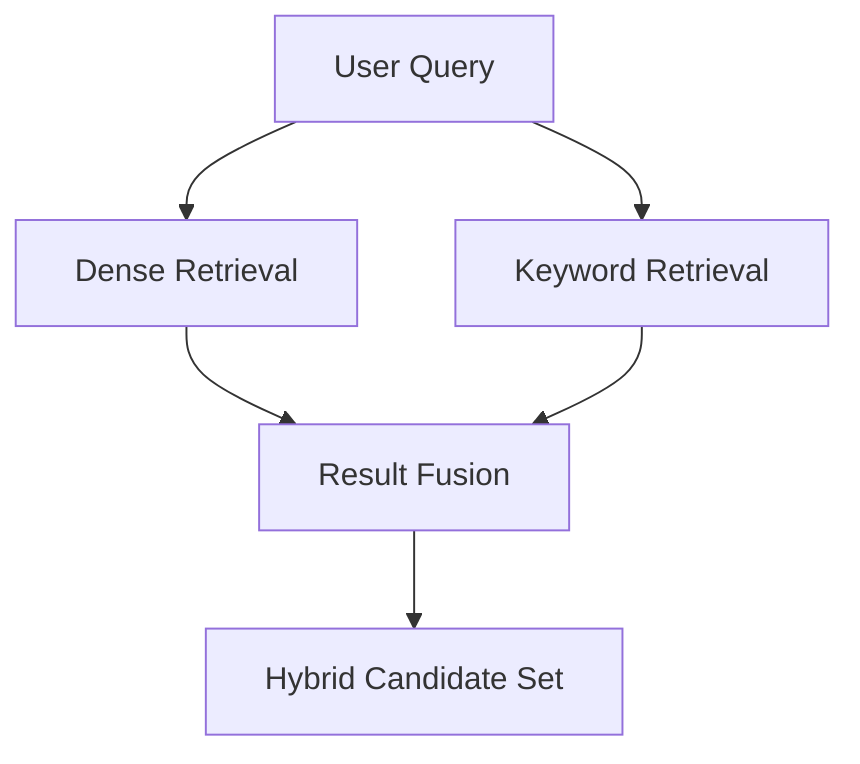

This matters more than it first appears. A user might ask a conceptual question, an exact-code question, or a mix of both. A dense-only system will miss some exact-match cases. A keyword-only system will miss paraphrased semantic matches. Hybrid retrieval covers both failure modes better.

There is one important engineering caveat here. `ChromaDB` is primarily a vector store, so hybrid retrieval is not simply a switch that turns on automatically. The application will need either:

- a separate lexical index
- metadata-assisted keyword retrieval
- or a custom result-fusion layer

That is still compatible with this stack. It just means hybrid retrieval should be treated as an application-layer design choice, not assumed to come for free from the vector database alone.

For the retrieval concepts behind this choice, including semantic, keyword, and hybrid retrieval, see [Building an AI Chatbot with RAG From Fundamentals to System Design](/rag/2026/03/20/building-an-ai-chatbot-with-rag-from-fundamentals-to-system-design.html).

---

## 10. Choosing the Reranker: Why ColBERT

First-stage retrieval is optimized for speed, not perfect ranking. That means the best answer may already be present in the candidate set but still be buried behind weaker chunks. This is where reranking becomes valuable.

### Reranking Comparison

| Method | Type | Accuracy | Speed | Cost | Notes |
| --- | --- | --- | --- | --- | --- |
| Cross-encoder (MiniLM/BGE) | Neural | High | Medium | Free | Local |
| Cohere Rerank | API | Very High | Medium | Paid | Managed |
| ColBERT | Late interaction | Very High | Medium-High | Free | Complex |
| LLM reranker | Generative | Highest | Slow | High | Context-aware |

`ColBERT` is selected because the system is emphasizing retrieval quality. Compared with simpler rerankers, ColBERT's late-interaction approach preserves richer token-level matching and often improves precision on hard retrieval problems.

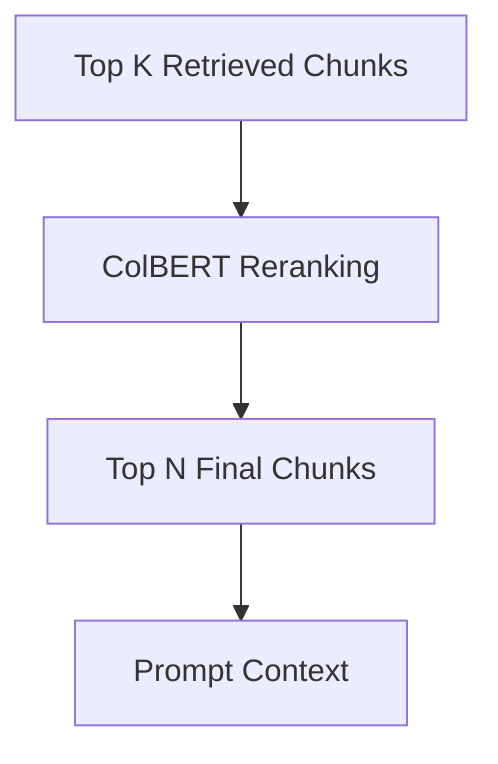

This is one of the more ambitious selections in the stack. ColBERT is not the easiest reranker to integrate, and it is more operationally complex than using a basic cross-encoder. But it is selected here because reranking is where a relatively small increase in complexity can lead to a meaningful increase in answer quality.

If the system later needs a lighter MVP path, a cross-encoder can still be used as a temporary fallback. But the target architecture aims higher on precision, so `ColBERT` is the preferred choice.

For the role of reranking in the broader RAG pipeline, see [Building an AI Chatbot with RAG From Fundamentals to System Design](/rag/2026/03/20/building-an-ai-chatbot-with-rag-from-fundamentals-to-system-design.html).

---

## 11. Choosing the LLM Layer: Why Two Groq Models

The final stage is generation. At this point the system has already done the hard work of finding and refining relevant context. The model now needs to answer clearly, stay grounded, and handle different styles of questions.

### LLM Comparison

| Model | Quality | Speed | Cost | Notes |
| --- | --- | --- | --- | --- |
| OpenAI GPT | Very High | Medium | Paid | General |
| Claude | Very High | Medium | Paid | Safe |
| Gemini | High | Medium | Paid | Multimodal |
| Groq GPT-OSS 120B | High | Fast | Low/Free | High throughput |
| Groq DeepSeek-R1 | High | Fast | Low/Free | Reasoning |
| Open-source models | Medium-High | Medium | Free | Flexible |

Instead of selecting a single model, this system uses two:

- `Groq GPT-OSS 120B` for fast general answering
- `Groq DeepSeek-R1` for reasoning-heavy queries

That provides a useful runtime toggle.

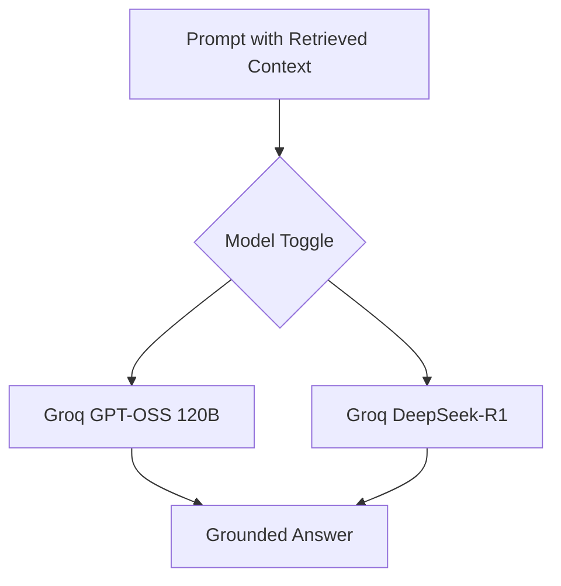

This is a better fit than forcing one model to handle every situation in the same way. Some questions need quick grounded summarization. Others need more stepwise reasoning or stronger synthesis. The toggle makes that distinction explicit.

The system design should reflect that operationally:

- use `GPT-OSS 120B` as the speed-first default
- use `DeepSeek-R1` when the query demands more reasoning depth

---

## 12. The Final Selected Architecture

At this point the individual choices can be assembled into one coherent system.

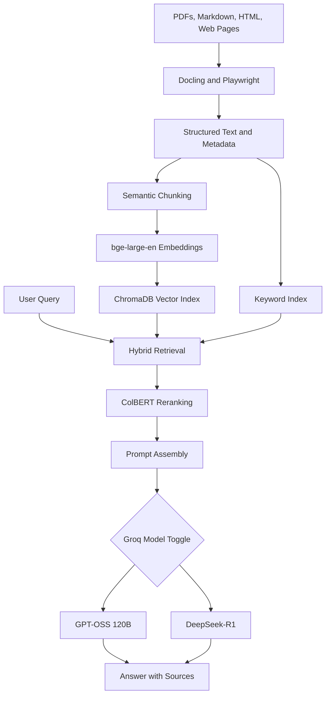

This architecture is balanced around four goals:

- strong retrieval quality
- reasonable operational simplicity
- low mandatory recurring cost
- flexibility for both files and web content

---

## 13. A Small Demo of the Final System

To make the architecture concrete, here is a small conceptual demo flow. The goal is not to show production code, but to show how the selected components work together in sequence.

### Demo Scenario

Suppose the system ingests:

- a PDF handbook through `Docling`
- a documentation page through `Playwright`

The content is parsed into structured text, split with semantic chunking, embedded with `bge-large-en`, and indexed in `ChromaDB`. A lightweight keyword layer is also maintained so the system can support hybrid retrieval.

When a user asks a question, the system:

1. runs dense retrieval against the vector index
2. runs keyword retrieval against the lexical layer
3. fuses the result lists into one candidate set
4. reranks the candidates with `ColBERT`
5. builds a grounded prompt from the top chunks
6. sends the prompt to the selected Groq model

That flow looks like this:

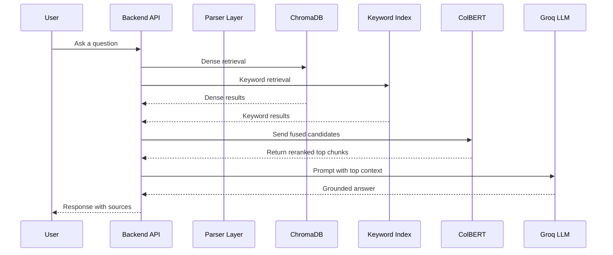

The model toggle can be applied at the final call:

- choose `GPT-OSS 120B` when speed matters most
- choose `DeepSeek-R1` when reasoning quality matters more

---

## 14. Why This Combination Works Well Together

The strength of this system is not in any one component. It is in how the components reinforce one another.

`Docling` preserves structure, which improves chunk boundaries. Semantic chunking preserves meaning, which improves embeddings. `bge-large-en` gives the vector layer strong semantic signal. Hybrid retrieval compensates for the limits of dense-only search. `ColBERT` improves precision before generation. The Groq model toggle lets the final generation stage adapt to the query type.

That is the real reason for the final stack. Each component was selected not only because it performs well in isolation, but because it improves the effectiveness of the next layer.

---

## 15. Practical Caveats

This architecture is strong, but it is not magic. A few trade-offs should be explicit.

`ChromaDB` keeps the vector layer simple, but hybrid retrieval will still require extra application logic for the keyword side.

`ColBERT` improves precision, but it adds implementation complexity. It is a quality-oriented decision, not a simplicity-oriented one.

Semantic chunking improves meaning preservation, but it increases ingestion complexity and tuning effort.

The two-model Groq setup improves flexibility, but it also means the application should define clear routing rules rather than leaving the toggle as a purely manual decision forever.

These are acceptable trade-offs because they are aligned with the project goal: build a higher-quality RAG chatbot while staying mostly self-managed and avoiding unnecessary paid infrastructure.

---

## 16. Final Conclusion

A strong RAG chatbot is not built by choosing a single great model. It is built by selecting the right pipeline.

In this design:

- `Docling` is selected because data quality starts with structured parsing
- `Playwright` is selected because modern web content often requires browser rendering
- `Semantic chunking` is selected because retrieval quality depends on meaningful context boundaries
- `bge-large-en` is selected because it offers strong open embedding performance
- `ChromaDB` is selected because it keeps the vector layer simple and practical
- `Hybrid search` is selected because real user queries need both semantic and lexical matching
- `ColBERT` is selected because reranking is one of the best leverage points for improving answer quality
- `Groq GPT-OSS 120B` and `Groq DeepSeek-R1` are selected because the system benefits from both speed-first and reasoning-first generation modes

The result is a RAG architecture that is coherent, grounded, and practical. More importantly, it is a design where each component has a clear reason for being there.

For the conceptual foundation behind this article's implementation choices, see [Building an AI Chatbot with RAG From Fundamentals to System Design](/rag/2026/03/20/building-an-ai-chatbot-with-rag-from-fundamentals-to-system-design.html).
