# Building a RAG Chatbot: How to Choose Each Component and Why

For the phase-by-phase implementation sequence based on this architecture, see *RAG Chatbot Phase-by-Phase Execution Plan*.

Retrieval-Augmented Generation, or RAG, is one of the most practical ways to build a useful AI chatbot. It combines retrieval with generation so the model can answer from external knowledge instead of relying only on training-time memory. That makes the system more current, more controllable, and easier to align with private or domain-specific data.

The hard part is not understanding the basic idea. The hard part is selecting the right components for the pipeline. A real RAG system is made of multiple layers: application infrastructure, document ingestion, parsing, chunking, embeddings, storage, retrieval, reranking, and generation. Every one of those layers introduces trade-offs in quality, cost, speed, and engineering complexity.

This article starts from the system view of RAG, walks through the major implementation options for each component, and then explains why this project selects the following final stack:

- Architecture posture: `cloud-first architecture developed locally and deployed to AWS`
- API layer: `FastAPI`
- Application data: `SQLite for local quick start, PostgreSQL for production`
- Document loader and parser: `Docling`
- Chunking strategy: `hierarchical structure-first chunking with token-based sub-chunks`
- Embedding model: `bge-large-en`
- Vector database: `Qdrant`
- Retrieval strategy: `hybrid retrieval using vector search plus BM25`
- Web scraping tool: `Playwright`
- Reranking: `cross-encoder reranker such as bge-reranker`
- LLM layer: `Groq as the default provider with environment-driven model switching`

The goal here is not just to list tools. It is to show how each choice fits into the full architecture and why it was selected over the alternatives.

The selected stack now reflects a cloud-first design rather than a local-first prototype. That means the system still runs comfortably in local development, but the interfaces, storage choices, and service boundaries are selected so the same design can later move to AWS without structural rework.

For the broader conceptual explanation of how RAG works from first principles through system design, see [Building an AI Chatbot with RAG From Fundamentals to System Design](/rag/2026/03/20/building-an-ai-chatbot-with-rag-from-fundamentals-to-system-design.html).

## 1. What a RAG Chatbot Actually Does

A RAG chatbot combines search and generation in a single pipeline. Instead of asking the model to answer from memory, the system first retrieves relevant content and then gives that content to the model as evidence.

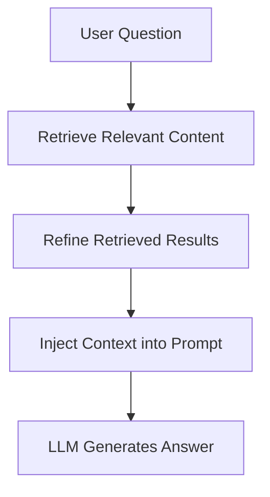

This changes the role of the model. In a healthy RAG system, the model is not the search engine. It is the final synthesizer. Retrieval finds evidence, reranking improves that evidence, and the model explains or combines it into a useful answer.

That distinction matters because many RAG failures are not generation failures. They are retrieval failures. If the system retrieves weak or irrelevant context, even a strong model will produce a weak answer.

That system-level separation of responsibilities is explained in more depth in [Building an AI Chatbot with RAG From Fundamentals to System Design](/rag/2026/03/20/building-an-ai-chatbot-with-rag-from-fundamentals-to-system-design.html).

## 2. Why RAG Systems Need Careful Component Selection

RAG is attractive because it solves several problems that plain LLM applications struggle with:

- answers can be grounded in real documents
- knowledge can be updated without retraining
- private information can stay outside the base model
- citations and source visibility become possible

But RAG is not one technology. It is a chain of technologies, and the output quality depends on the weakest link in that chain.

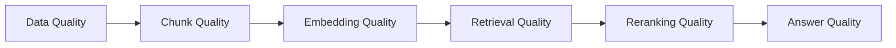

That is why component selection matters. A good vector database will not fix poor parsing. A good LLM will not fix poor retrieval. A strong reranker cannot recover information that never made it into the index in the first place.

## 3. The Full RAG Pipeline

A production-style RAG chatbot usually has two major flows: ingestion and query-time answering.

This section is the stack-specific companion to the architecture discussion in [Building an AI Chatbot with RAG From Fundamentals to System Design](/rag/2026/03/20/building-an-ai-chatbot-with-rag-from-fundamentals-to-system-design.html).

In the selected architecture, ingestion is an offline, source-managed workflow. It builds the context layer ahead of time. Chat requests should only read from prepared indexes and should never trigger crawling, parsing, or embedding work inside `/chat`.

### Ingestion Pipeline

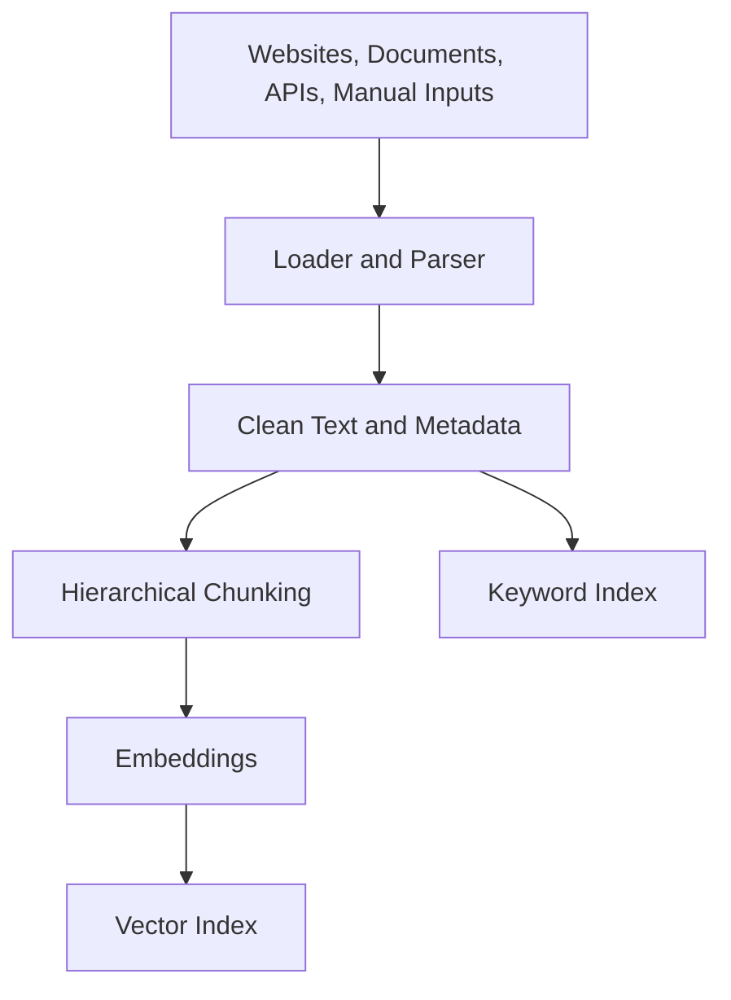

### Query Pipeline

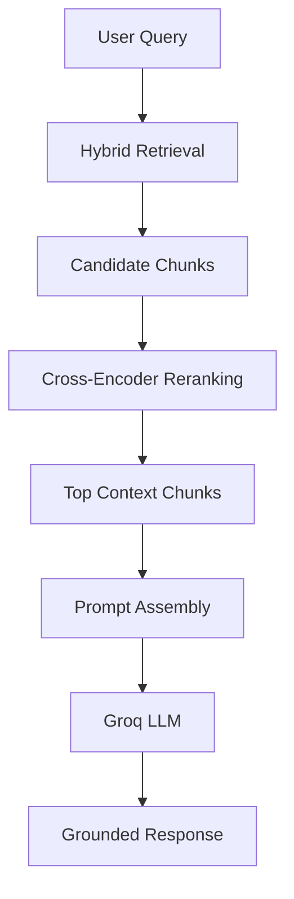

These flows are tightly connected. Better document parsing improves chunking. Better chunking improves embeddings. Better embeddings improve first-stage retrieval. Better retrieval gives the reranker stronger candidates. Better reranked context gives the model a better chance of producing a correct answer.

## 4. Choosing the Document Loader: Why Docling

The first major decision is how raw files become machine-usable text. This layer is often underestimated, but it has direct downstream impact on the entire system.

### Loader Comparison

| Tool | Type | Output Quality | Structure Awareness | Notes |
| --- | --- | --- | --- | --- |
| Manual loader | Custom | High | Medium | Full control |
| LlamaIndex loaders | Framework | Medium | Medium | Plug-and-play |
| LangChain loaders | Framework | Medium | Medium | Integrations |
| Unstructured | Parsing lib | High | High | Complex docs |
| Docling | Parser | High | High | Structured content |
| LlamaParse | Managed | Very High | Very High | Paid |
| Apache Tika | General parser | Medium | Low | Broad formats |

The comparison shows a clear pattern. Simple loaders are easy to wire up, but they usually preserve less structure. Managed parsers can produce excellent output, but they introduce external dependency and cost. General parsers support many formats, but they often flatten documents too aggressively for high-quality retrieval.

`Docling` is the selected choice because it gives a strong balance:

- high output quality
- high structure awareness
- no mandatory paid service
- strong fit for PDFs and complex documents

That balance matters because structure improves retrieval. Headings, sections, tables, and document boundaries all influence how chunks should be formed. If the parser destroys that structure too early, the later stages have to guess at meaning that was already available in the source.

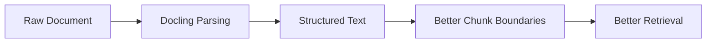

For this reason, the loader is not just an ingestion utility. It is a quality gate for the entire RAG pipeline.

## 5. Choosing the Web Ingestion Tool: Why Playwright

Some knowledge lives in files. Some lives on websites. Modern websites often render important content through JavaScript, so basic static scraping is not always enough.

### Web Scraping Comparison

| Tool | JS Support | Speed | Resource | Notes |
| --- | --- | --- | --- | --- |
| requests + BeautifulSoup | No | Fast | Low | Static sites |
| Scrapy | No | Fast | Low | Large-scale |
| Playwright | Yes | Medium | Medium-High | Dynamic sites |
| Selenium | Yes | Slow | High | Legacy |
| Puppeteer | Yes | Medium | Medium | Node-based |

`Playwright` is selected because this system needs reliable handling of dynamic web pages. It is not the lightest option, but it is the most practical when content is rendered client-side, requires interaction, or appears behind navigation and authenticated flows.

That makes it a better choice than static HTML scraping for modern documentation sites and application-driven content.

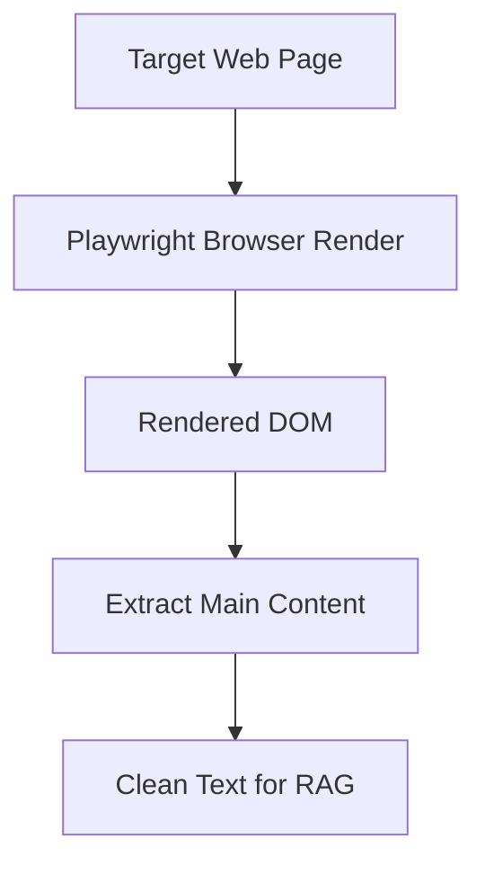

The trade-off is clear: more capability costs more compute. That means Playwright should be used intentionally, with domain restrictions, crawl depth limits, and page filters, not as the default for every possible URL.

## 6. Choosing the Chunking Strategy: Why Hierarchical Structure-First Chunking

Chunking is one of the highest-impact decisions in a RAG system. If chunks are too small, useful meaning gets split apart. If they are too large, retrieval becomes noisy and prompt cost rises.

### Chunking Comparison

| Strategy | Quality | Complexity | Notes |
| --- | --- | --- | --- |
| Fixed-size | Medium | Low | Simple |
| Recursive | High | Low-Medium | Good baseline |
| Token-based | High | Medium | Predictable |
| Markdown/code-aware | High | Medium | Docs |
| Semantic | Very High | High | Meaning-based |
| Hierarchical structure plus token chunking | Very High | Medium | Structured and practical |

The selected strategy is hierarchical chunking:

1. split by document structure first
2. then chunk by token length

This approach is chosen because it keeps most of the quality advantages of structure-aware chunking while remaining easier to debug, tune, and operate than pure semantic chunking.

In practice, that means:

- preserve headings and section boundaries from the parser
- create token-based chunks of roughly 400 to 600 tokens
- use 50 to 100 tokens of overlap
- attach source-aware metadata such as URL, title, section, and timestamp

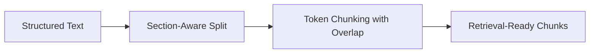

This is a more production-friendly choice for the current system than pure semantic chunking. It gives deterministic chunk boundaries, works consistently across documents and websites, and makes retrieval debugging easier when quality issues appear.

That relationship between document structure and chunk quality is also discussed conceptually in [Building an AI Chatbot with RAG From Fundamentals to System Design](/rag/2026/03/20/building-an-ai-chatbot-with-rag-from-fundamentals-to-system-design.html).

## 7. Choosing the Embedding Model: Why bge-large-en

Embeddings turn chunks into vector representations so semantically similar content can be retrieved together.

### Embedding Comparison

| Model | Type | Quality | Speed | Cost |
| --- | --- | --- | --- | --- |
| MiniLM | Open-source | Medium-High | Fast | Free |
| BGE | Open-source | High | Medium | Free |
| OpenAI embeddings | API | Very High | Medium | Paid |
| Voyage AI | API | Very High | Medium | Paid |

The selected model is `bge-large-en`.

This choice reflects a practical middle path. API-based embeddings can be excellent, but they add recurring cost and an external dependency. Smaller open models are faster, but they can give up some retrieval quality.

`bge-large-en` is selected because it offers:

- strong open-source embedding quality
- good semantic retrieval performance for English
- no mandatory API cost

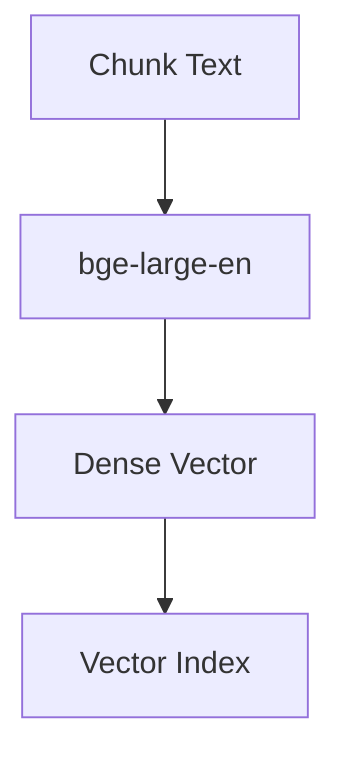

The trade-off is compute. Larger local embedding models are heavier than smaller alternatives. But since this system is optimizing for retrieval quality while staying largely self-managed, that is a reasonable exchange.

## 8. Choosing the Vector Database: Why Qdrant

Once chunks are embedded, they need to be indexed and retrieved efficiently.

### Vector Database Comparison

| Tool | Type | Scalability | Complexity | Cost |
| --- | --- | --- | --- | --- |
| FAISS | Library | Low | Low | Free |
| ChromaDB | Local DB | Medium | Low | Free |
| Qdrant | Vector DB | High | Medium | Free/Paid |
| Pinecone | Managed | Very High | Low | Paid |
| Weaviate | Vector DB | High | High | Free/Paid |
| pgvector | PostgreSQL extension | Medium | Medium | Low |

`Qdrant` is selected because the system is now designed as cloud-first rather than local-first. That changes the decision criteria. Local convenience still matters, but production portability matters from the beginning.

`Qdrant` fits this project well because it offers:

- a local runtime that is still easy to develop against
- a clean path to Qdrant Cloud or self-hosted production deployment
- stronger production-oriented vector database behavior than lightweight local-only stores
- a better match for an AWS-ready architecture


This does not mean the system is aiming at massive scale on day one. It means the selected vector store should not force a redesign later just because the project moves from one laptop to a cloud deployment.

## 9. Choosing the Retrieval Strategy: Why Hybrid Search

Dense vector retrieval is strong for meaning, but weak for exact identifiers, codes, numbers, and specific strings. Keyword search has the opposite profile. Real queries often need both.

### Retrieval Comparison

| Strategy | Accuracy | Latency | Complexity |
| --- | --- | --- | --- |
| Similarity search | Medium-High | Low | Low |
| Hybrid search | High | Medium | Medium |
| Multi-query | High | Medium-High | Medium |

`Hybrid search` is selected because it is the best default for real-world RAG.

It combines:

- semantic retrieval for concept matching
- lexical retrieval for exact term matching

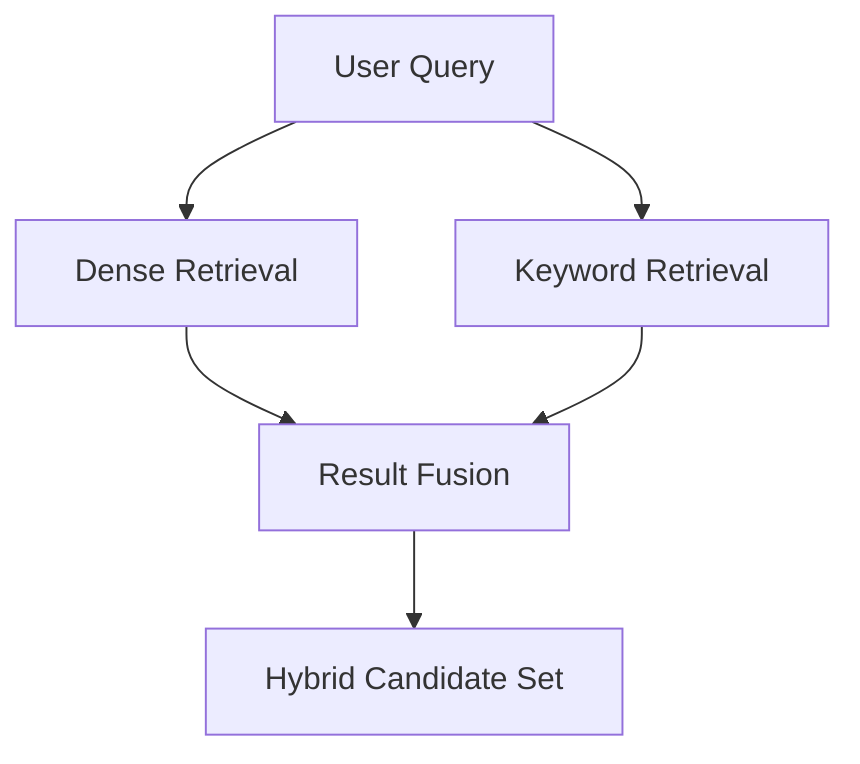

This matters more than it first appears. A user might ask a conceptual question, an exact-code question, or a mix of both. A dense-only system will miss some exact-match cases. A keyword-only system will miss paraphrased semantic matches. Hybrid retrieval covers both failure modes better.

There is one important engineering caveat here. `Qdrant` is still primarily the vector side of the retrieval stack. The BM25 side and the merge logic remain application-level responsibilities. That is fully compatible with this architecture, but it means hybrid retrieval should be treated as a deliberate retrieval design, not assumed to come for free from the vector database alone.

In the selected pipeline, hybrid retrieval produces a candidate set first. That candidate set then flows into reranking:

```text
Query
-> vector retrieval
-> BM25 retrieval
-> hybrid merge
-> top 10 candidates
```

For the retrieval concepts behind this choice, including semantic, keyword, and hybrid retrieval, see [Building an AI Chatbot with RAG From Fundamentals to System Design](/rag/2026/03/20/building-an-ai-chatbot-with-rag-from-fundamentals-to-system-design.html).

## 10. Choosing the Reranker: Why a Cross-Encoder

First-stage retrieval is optimized for speed, not perfect ranking. That means the best answer may already be present in the candidate set but still be buried behind weaker chunks. This is where reranking becomes valuable.

### Reranking Comparison

| Method | Type | Accuracy | Speed | Cost | Notes |
| --- | --- | --- | --- | --- | --- |
| Cross-encoder (MiniLM/BGE) | Neural | High | Medium | Free | Local and practical |
| Cohere Rerank | API | Very High | Medium | Paid | Managed |
| ColBERT | Late interaction | Very High | Medium-High | Free | More complex |
| LLM reranker | Generative | Highest | Slow | High | Context-aware |

A cross-encoder reranker, such as `bge-reranker`, is selected because it gives the best balance for the current system:

- better ranking precision than first-stage retrieval alone
- materially simpler integration than ColBERT
- a good fit for reranking a small candidate set such as top 10 chunks
- strong quality for the current low-to-moderate scale target

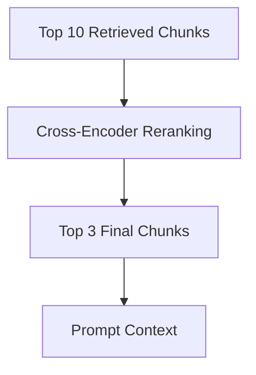

This is a deliberate shift from a more ambitious reranker toward a more production-friendly one. ColBERT can be powerful, but the selected architecture values clean integration, debuggability, and good quality without pulling in unnecessary operational complexity too early.

For the role of reranking in the broader RAG pipeline, see [Building an AI Chatbot with RAG From Fundamentals to System Design](/rag/2026/03/20/building-an-ai-chatbot-with-rag-from-fundamentals-to-system-design.html).

## 11. Choosing the LLM Layer: Why Groq with Model Abstraction

The final stage is generation. At this point the system has already done the hard work of finding and refining relevant context. The model now needs to answer clearly, stay grounded, and integrate cleanly into a provider abstraction.

### LLM Comparison

| Option | Quality | Speed | Cost | Notes |
| --- | --- | --- | --- | --- |
| OpenAI GPT | Very High | Medium | Paid | General |
| Claude | Very High | Medium | Paid | Safe |
| Gemini | High | Medium | Paid | Broad ecosystem |
| Groq-hosted models | High | Fast | Low/Free | Strong serving speed |
| Self-hosted open models | Medium-High | Variable | Infra cost | Full control |

The selected strategy is:

- use `Groq` as the default provider
- keep the model choice behind an environment-driven abstraction
- start with a strong default model such as `DeepSeek-R1`
- keep the system ready to switch models without changing application code

```env
LLM_PROVIDER=groq
LLM_MODEL=deepseek-r1
```

This is a better fit than hardcoding one provider-model pair into the application architecture. The project wants a stable `llm_service` contract first, then model experimentation behind configuration.

That operationally means:

- `Groq` is the default provider
- model selection stays separate from provider selection
- streamed and non-streamed generation should both fit behind the same abstraction

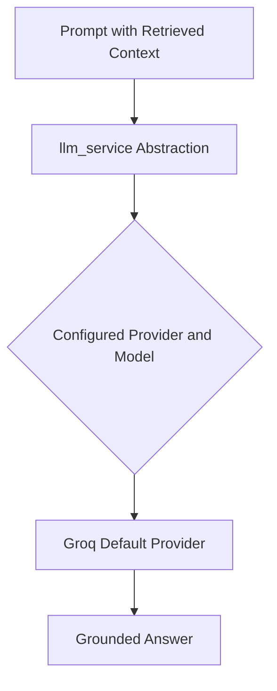

This keeps the application aligned with the execution plan: introduce the provider abstraction early, use Groq by default, and make model switching operational rather than architectural.

## 12. The Final Selected Architecture

At this point the individual choices can be assembled into one coherent system.

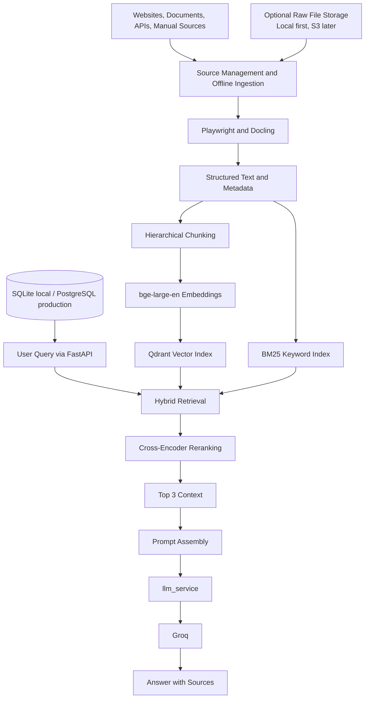

This architecture is balanced around five goals:

- strong retrieval quality
- cloud portability from the beginning
- low mandatory recurring cost
- manageable operational complexity
- flexibility for both files and web content

## 13. A Small Demo of the Final System

To make the architecture concrete, here is a small conceptual demo flow. The goal is not to show production code, but to show how the selected components work together in sequence.

### Demo Scenario

Suppose the system registers:

- a PDF handbook through the document ingestion path
- a documentation site through a Playwright-based website source

The ingestion workflow runs offline. The content is parsed into structured text, split with hierarchical chunking, embedded with `bge-large-en`, and indexed in `Qdrant`. A BM25-backed lexical layer is also maintained so the system can support hybrid retrieval. Raw documents may be stored temporarily or locally for debugging, but the runtime path depends on parsed content, chunks, and embeddings rather than on raw files.

When a user asks a question, the system:

1. runs dense retrieval against `Qdrant`
2. runs BM25 retrieval against the lexical layer
3. merges the result lists into one candidate set
4. reranks the candidates with a cross-encoder
5. builds a grounded prompt from the top chunks
6. sends the prompt to `Groq` through `llm_service`

That flow looks like this:

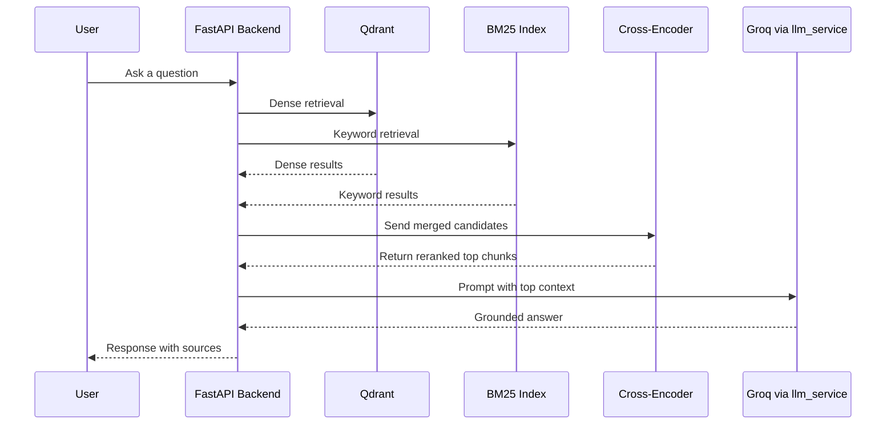

Because the model layer is configuration-driven, the final call does not hardcode one model forever. The system can keep `Groq` as the default provider while still switching models through environment configuration as evaluation and refinement progress.

## 14. Why This Combination Works Well Together

The strength of this system is not in any one component. It is in how the components reinforce one another.

`FastAPI` plus PostgreSQL-compatible persistence gives the application a production-shaped backbone. SQLite keeps local startup light without changing the ORM model. `Docling` preserves structure, which improves chunk boundaries. Hierarchical chunking turns that structure into stable, retrieval-friendly units. `bge-large-en` gives the dense layer strong semantic signal. `Qdrant` gives the vector layer a better cloud-ready foundation. Hybrid retrieval compensates for the limits of dense-only search. The cross-encoder improves precision before generation. Groq and the `llm_service` abstraction keep the model layer swappable without turning the whole application into provider-specific code.

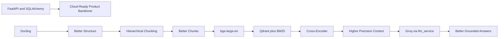

That is the real reason for the final stack. Each component was selected not only because it performs well in isolation, but because it improves the effectiveness of the next layer.

## 15. Practical Caveats

This architecture is strong, but it is not magic. A few trade-offs should be explicit.

`Qdrant` gives the vector layer a better production story than a lightweight local-first store, but it is slightly heavier to operate in development.

Hybrid retrieval improves recall, but it still requires a separate BM25 or lexical layer plus result-fusion logic in the application.

Cross-encoder reranking improves precision, but it adds latency compared with retrieval-only pipelines. That is acceptable here because the target scale is moderate and answer quality matters more than shaving every millisecond.

Hierarchical chunking is more operationally stable than pure semantic chunking, but it still needs tuning. Poor chunk boundaries will still damage retrieval quality.

The Groq-based model layer improves flexibility, but the application still needs clear defaults, retries, timeout handling, and evaluation-driven model choices rather than ad hoc switching.

SQLite is useful for local quick start, but it is not the production data layer. That role belongs to PostgreSQL.

Raw document storage should remain an operational convenience, not a design dependency. For a few hundred documents, local storage is enough. S3 only becomes necessary when durability, distributed ingestion, or larger-scale operations justify it.

These are acceptable trade-offs because they are aligned with the project goal: build a higher-quality RAG chatbot that is simple enough to develop locally but production-shaped enough to deploy to AWS later.

## 16. Final Conclusion

A strong RAG chatbot is not built by choosing a single great model. It is built by selecting the right pipeline and the right operational boundaries.

In this design:

- `FastAPI` is selected because the backend should be simple, explicit, and production-ready
- `SQLite` and `PostgreSQL` are selected together because local development should stay lightweight without changing the production data model
- `Docling` is selected because data quality starts with structured parsing
- `Playwright` is selected because modern web content often requires browser rendering
- `Hierarchical structure-first chunking` is selected because retrieval quality depends on stable, meaningful context boundaries
- `bge-large-en` is selected because it offers strong open embedding performance
- `Qdrant` is selected because it provides a better cloud-ready vector layer without giving up local development
- `Hybrid search` is selected because real user queries need both semantic and lexical matching
- `Cross-encoder reranking` is selected because it materially improves answer precision without the integration complexity of heavier rerankers
- `Groq` with environment-driven model switching is selected because the model layer should stay fast, swappable, and operationally flexible

The result is a RAG architecture that is coherent, grounded, and practical. More importantly, it is a design where each component has a clear reason for being there and where the overall system matches the current execution plan instead of fighting it.

For the conceptual foundation behind this article's implementation choices, see [Building an AI Chatbot with RAG From Fundamentals to System Design](/rag/2026/03/20/building-an-ai-chatbot-with-rag-from-fundamentals-to-system-design.html).
